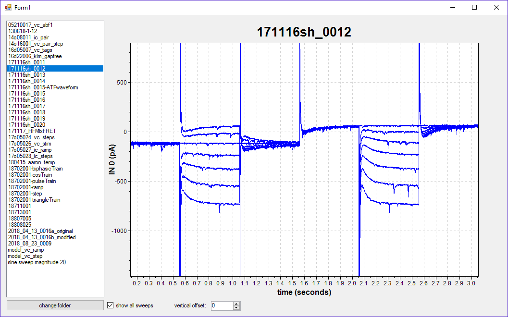
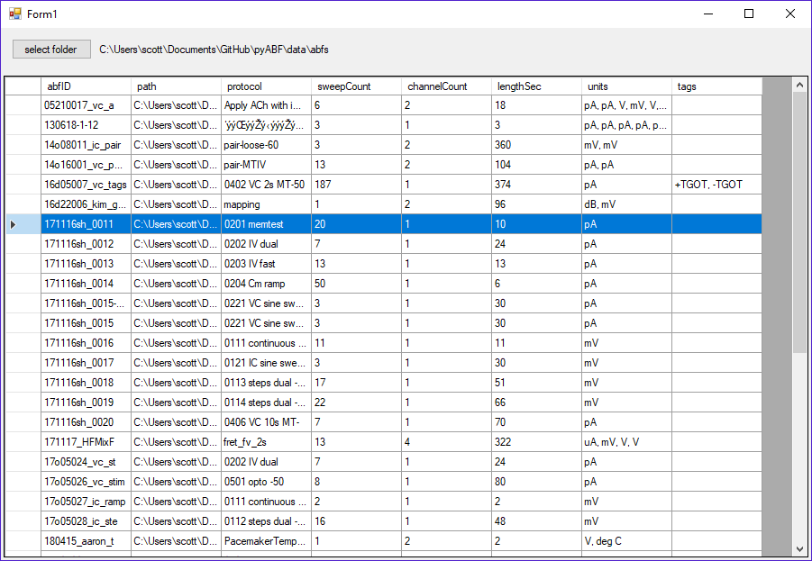

# vsABF

**The vsABF project provides simple interface to access to header and signal data from Axon Binary Format (ABF) files in Visual Studio**. vsABF is written in C# and is based largely upon the [pyABF project](https://github.com/swharden/pyABF) (a similar library for Python). This project is in its infancy. To lean more about the ABF file format, visit the [pyABF project](https://github.com/swharden/pyABF).

Note: this project depends on adding a reference to the latest [ScottPlot](https://github.com/swharden/ScottPlot)