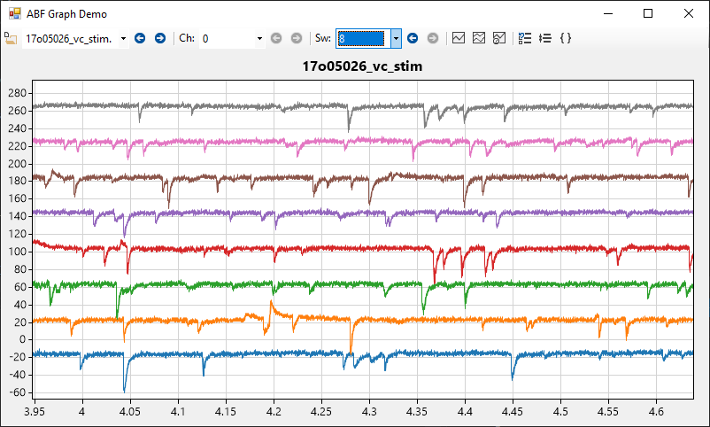

# vsABF

**vsABF is a portable class library to access header and signal data from Axon Binary Format (ABF) files in Visual Studio**. This project is written
entirely in C# and draws much from ABF file format information documented in the [pyABF project](https://github.com/swharden/pyABF). 

## Compiled Demos
**Want to see what vsABF can do?** Click-to-run EXE demos are in [/dev/compiled/](/dev/compiled)

## ABF File Reading Methods
The vsABF project contains two sub-projects which demonstrate how to read ABF files in two very different ways.

### Method 1: Read ABF file content directly
While Molecular Devices keeps the format of their ABF2 files largely a secret,
enough about the ABF1 and ABF2 file format is [known](https://github.com/swharden/pyABF/tree/master/docs/advanced/abf-file-format) 
that it is possible to extract virtually all useful data directly from the binary content of ABF files. What is known of the ABF1 and ABF2 file format is 
documented in the [pyABF project](https://github.com/swharden/pyABF), and a C# implementation of a direct ABF file reader is provided here.

* **Pros:** 
  * 100% pure C#/.NET solution (cross-platform)
  * 64-bit architecture is supported
  * header and data reading is _extremely_ highspeed
* **Cons:** 
  * only the most important header values are made available
  * proper functioning of ABF file reading is only tested on [a few dozen ABF files](https://github.com/swharden/pyABF/tree/master/data) we have access to, so less-common types of ABF files may not be supported

### **Method 2: Read ABF files using ABFFIO.dll** 
Molecular Devices provides their official ABF file input/output DLL (ABFFIO.dll)
as part of their SDK which can be downloaded online (previously [here](http://mdc.custhelp.com/app/answers/detail/a_id/18881/~/axon%E2%84%A2-pclamp%C2%AE-abf-file-support-pack-download-page), but now provided with [pCLAMP 11](http://mdc.custhelp.com/app/answers/detail/a_id/20260/~/axon%E2%84%A2-pclamp%E2%84%A2-11-electrophysiology-data-acquisition-%26-analysis-software)). The DLL is not open-source, 
but a few header files are provided. The DLL and headers were written for ANSI C, and does not easily interface with Visual Studio. At the core of the vsABF project is a class which does all the dirty work interacting with this DLL so you don't have to.

* **Pros:** 
  * full access to every value in the entire ABF header
  * header and data values are identical to ClampFit (which uses the same DLL)
* **Cons:** 
  * The DLL is 32-bit only
  * The DLL is Windows only
  * Using the DLL is slower than reading data out of the ABF directly

_**Why is ABFFIO.dll so difficult to interact with?** First, all documentation
provided is for 32-bit ANSI C, not C#. Consider that a C# `long` is 8 bytes
but to ANSI C it's 4. (In 32-bit ANSI C, `long` and `int` are actually the same
length). Now consider that just to open an ABF, you need to first create a struct to hold all the header values. This nightmare of a struct has 239 variables (95 of which are arrays) and all the declaration types have to be perfect for the header to load properly. Not to mention the frustrations associated with marshalling bytes in unsafe code blocks. Further complicating matters is that many of the strings contain null characters. Now that the ABF header struct has been created using strict type declaration (e.g., `Int32` instead of `long`) for all these variables, interacting with the DLL became far easier. In other words, creating the struct was arduous, but now that it has been created it is relatively easy to use._

# Screenshots

description | screenshot
---|---
vsABF user control (using ABFFIO.dll) | 
header inspection (using ABFFIO.dll) | 
data display (raw ABF file reading) | 
header inspection (raw ABF file reading) | 