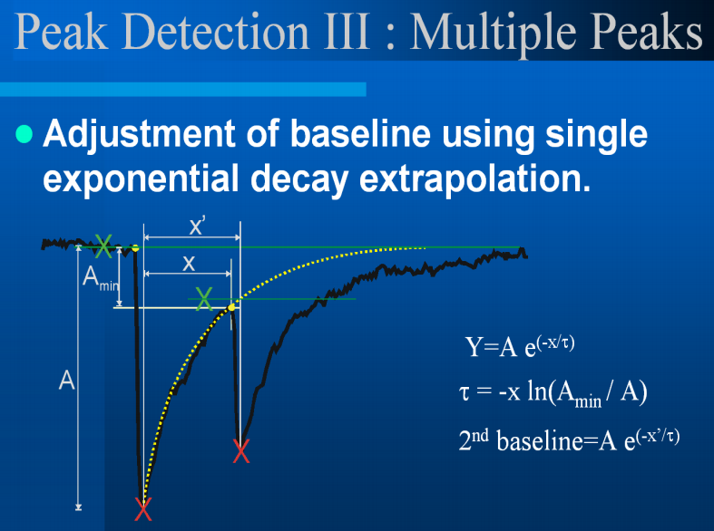

# ABF Analyzer

The ABF Analyzer is a simple program written to demonstrate the use of [vsABF](https://github.com/swharden/vsABF) together with [ScottPlot](https://github.com/swharden/ScottPlot).

## Parameter-based event detection
Parametric event detection is loosely inspired by Synaptosoft's [mini-analysis]() program. An overview of the computational method that software uses is described in [Neuronal-Signals-7-Detecting-Events.pdf](https://hayar.net/NBDS5161/Neuronal-Signals-7-Detecting-Events.pdf). These methods can be used to detect spontaneous EPSCs and IPSCs (including minature EPSCs and IPSCs) and action potentials.

### Detection Parameters

### Sequence of Event Detection

### Compound Peak Detection
